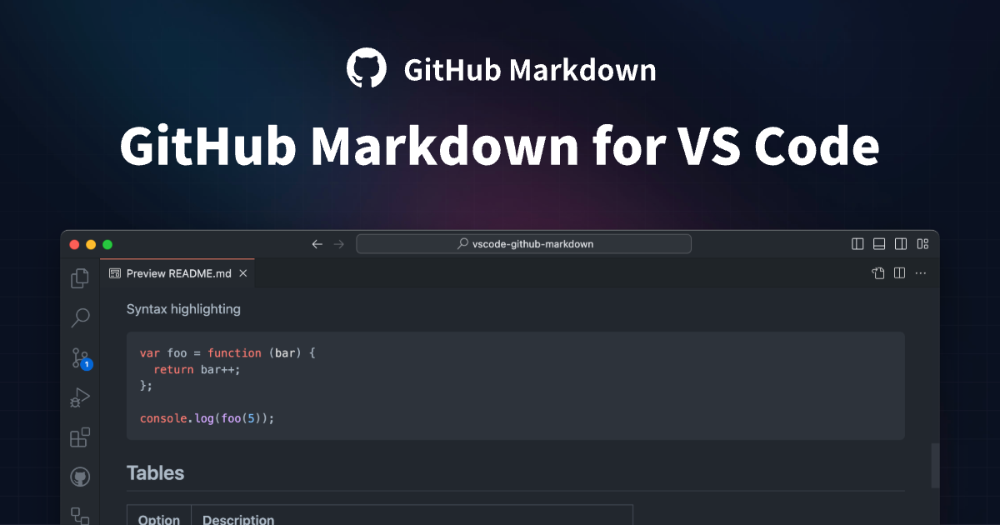

The GitHub Markdown extension gives you the same look and editing experience as the official theme.

## Feature

### Preview

Perfectly replicates the official preview style.

### Theme

Support official multiple color schemes.

### Enhance

Support official color-model preview effect.

Support official code copy effect.

Support official multi-type blockquote effects.

Support using absolute paths for images.

## Extension Commands

`GitHub Markdown: TODO`

## Related Information

- [Visual Studio Code's Markdown Support](http://code.visualstudio.com/docs/languages/markdown)
- [Markdown Syntax Reference](https://docs.github.com/en/get-started/writing-on-github/getting-started-with-writing-and-formatting-on-github/basic-writing-and-formatting-syntax)
- [Emoji Cheat Sheet](https://github.com/ikatyang/emoji-cheat-sheet/blob/master/README.md)

## License

This project is licensed under the terms of the [MIT](./LICENSE) open source license.
