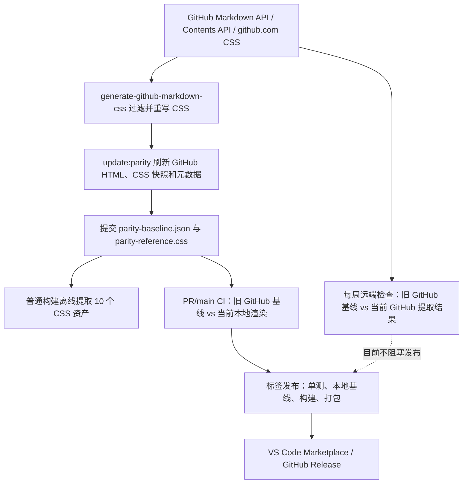

# 上游漂移与回归保障缺口调研

- 调研日期：2026-07-15
- 对应 Ticket：[评估上游漂移与回归保障缺口](https://github.com/lzm0x219/vscode-github-markdown/issues/1128)
- 结论性质：基于当前仓库、GitHub 动态配置和第一方来源的规划输入，不直接修改工具链

## 结论

当前方案已经解决了“构建时依赖 GitHub 可用性”的问题：发布构建只读取已提交的 CSS 快照，基线又用输入、渲染配置和 CSS 的 SHA-256 防止静默失配。现有 57 个视觉用例中，大多数本地比较采用零容差；桌面最低版本、桌面稳定版和 Web 稳定版另有宿主冒烟测试。[构建实现](../../../scripts/build/css.ts#L7-L15) · [基线校验](../../../scripts/parity/baseline.ts#L114-L161) · [CI 宿主矩阵](../../../.github/workflows/ci.yml#L65-L98)

但它还不能形成可靠的“上游变化 → 判断用户影响 → 修复 → 阻止带偏差版本发布”闭环，主要风险按优先级为：

1. **GitHub 参照 CSS 可能先被提取器静默裁剪。** `generate-github-markdown-css@6.6.0` 从一个 GitHub 仓库页面收集 CSS 链接，再按标签、类名、`data-*` 和 at-rule 规则过滤；非 `@layer` at-rule（包括媒体查询）、多数含 `data-*` 的选择器以及未进入允许列表的新类都可能被丢弃。远端像素比较使用这份提取结果，而不是实际 GitHub 页面 CSS，因此被丢弃的上游变化无法被任何像素阈值发现。[上游提取入口](https://github.com/sindresorhus/generate-github-markdown-css/blob/v6.6.0/index.js#L260-L296) · [上游过滤逻辑](https://github.com/sindresorhus/generate-github-markdown-css/blob/v6.6.0/index.js#L5-L99) · [本仓库参照 CSS 生成](../../../scripts/parity/browser.ts#L114-L117)
2. **发现漂移不是发布门禁。** 远端检查每周一运行一次，且只有 `schedule` 事件会执行；标签发布只运行本地基线比较，不重新对照当前 GitHub，也不执行桌面/Web 宿主冒烟测试。[CI 定时条件](../../../.github/workflows/ci.yml#L3-L9) · [远端检查条件](../../../.github/workflows/ci.yml#L45-L52) · [发布验证](../../../.github/workflows/publish.yml#L55-L77)。GitHub 明确说明定时任务可能延迟甚至被丢弃，并且公共仓库无活动 60 天后会自动停用定时任务；因此现状没有可承诺的最大检测时延。[GitHub `schedule` 说明](https://docs.github.com/en/actions/reference/workflows-and-actions/events-that-trigger-workflows#schedule)
3. **部分非零预算覆盖了整张截图，而不是已知宿主区域。** 语法高亮边界允许最多 24,000 个差异像素，平台渲染器用例允许最多 4,000,000 个差异像素、35% 比例和 700,000 像素连通区域；同一截图中发生的扩展自有布局、颜色或间距回归也可被这些总量预算吞掉。[预算定义](../../../scripts/parity/cases.ts#L149-L180) · [通过判定](../../../scripts/parity/cli.ts#L118-L148)
4. **失败信号缺少用户影响与故障类型。** 远端模式只比较“旧 GitHub + 旧提取 CSS”和“当前 GitHub + 当前提取 CSS”，不会同时给出“当前扩展与当前 GitHub”的差异；CSS 抓取、API 限流、HTML 提取失败和真实像素漂移也都表现为同一个失败工作流。若失败发生在截图报告写入前，上传步骤会忽略不存在的产物。[远端比较路径](../../../scripts/parity/cli.ts#L73-L173) · [产物上传](../../../.github/workflows/ci.yml#L54-L60)
5. **CI 存在制度性绕过。** 2026-07-15 使用 `gh api repos/lzm0x219/vscode-github-markdown/branches/main/protection` 核查时，`main` 的保护响应没有 `required_status_checks`，且允许 force push；GitHub 官方说明，未启用 required status checks 时，协作者可以在检查未通过或未完成时合并。[GitHub 分支保护说明](https://docs.github.com/en/repositories/configuring-branches-and-merges-in-your-repository/managing-protected-branches/about-protected-branches#require-status-checks-before-merging)。发布工作流虽会再次执行单元测试和本地像素基线，但无法补回远端当前态与宿主测试缺口。

因此，**v4.4 必须优先保证参照物完整、漂移探针独立、已知边界不遮蔽扩展回归，并把当前 GitHub 一致性接入发布门禁**。单纯增加更多像素用例或提高运行频率，不能修复参照 CSS 已被过滤这一根本问题。

## 当前检测链路

具体过程：

1. `update:parity` 通过 GitHub Markdown API 获取普通 GFM HTML，通过 Contents API 的 raw/html 媒体类型校验并获取仓库页面 HTML；仓库文件引用先解析为 40 位提交 SHA。GitHub 官方把 Markdown API 定义为“把 Markdown 文档渲染为 HTML”，并说明 `gfm`/`context` 参数；Contents API 的 HTML 媒体类型则由 GitHub Markup 渲染。[本仓库 GitHub 客户端](../../../scripts/parity/github.ts#L14-L71) · [GitHub Markdown API](https://docs.github.com/en/rest/markdown/markdown#render-a-markdown-document) · [GitHub Contents API](https://docs.github.com/en/rest/repos/contents#get-repository-content)
2. 同一刷新命令调用 `generate-github-markdown-css@6.6.0`，生成共享样式和九套主题变量，再保存 `parity-reference.css`；同时记录生成时间、Chromium 版本、渲染配置哈希、CSS 哈希、输入哈希和 GitHub HTML。[CSS 资产生成](../../../scripts/build/github-css.ts#L70-L109) · [基线结构](../../../scripts/parity/baseline.ts#L19-L39) · [刷新实现](../../../scripts/parity/cli.ts#L183-L203)
3. 普通 `build` 不联网，只从已提交参照 CSS 拆出一个共享文件和九个主题文件。这是可靠的供应链冻结点，即使 GitHub 临时不可用，用户仍能得到与已审核快照一致的扩展。[离线读取](../../../scripts/build/github-css.ts#L34-L67) · [架构说明](../../../ARCHITECTURE.md#presentation-and-themes)
4. PR 和 `main` CI 先校验基线指纹，再在同一个无 JavaScript、`1024×720`、DPR 1 的 Chromium 页面中比较旧 GitHub HTML/旧参照 CSS与当前本地 Markdown/CSS；失败时写出 expected、actual、diff 和 JSON/Markdown 报告。[浏览器配置](../../../scripts/parity/browser.ts#L21-L45) · [截图实现](../../../scripts/parity/browser.ts#L77-L111) · [报告实现](../../../scripts/parity/cli.ts#L353-L388)
5. 每周定时运行把“当前 GitHub HTML + 当前提取 CSS”与已提交 GitHub 基线比较，所有远端用例固定零容差。最近可见的定时运行于 2026-07-13 成功，但一次成功只能证明当时、当前样本和提取范围内没有像素变化。[远端零容差](../../../scripts/parity/cli.ts#L125-L138) · [定时运行记录](https://github.com/lzm0x219/vscode-github-markdown/actions/runs/29229256224)
6. `v*` 标签触发发布：校验标签/版本、审计、lint、单测、本地像素基线、构建、发行说明和打包，随后发布 Marketplace 和 GitHub Release；这里没有当前 GitHub 远端检查或宿主矩阵。[发布工作流](../../../.github/workflows/publish.yml)

## 控制措施与盲区

| 领域          | 当前控制                                                                                                                                                      | 覆盖盲区或误报来源                                                                                                                                                                                                          | 用户影响                                                                            | 判断                                                                         |
| ------------- | ------------------------------------------------------------------------------------------------------------------------------------------------------------- | --------------------------------------------------------------------------------------------------------------------------------------------------------------------------------------------------------------------------- | ----------------------------------------------------------------------------------- | ---------------------------------------------------------------------------- |
| 构建可复现性  | CSS 快照提交到仓库；普通构建离线；依赖锁定 `generate-github-markdown-css@6.6.0`。[package.json](../../../package.json)                                        | 快照只有结果哈希，没有抓取页面、CSS 资产 URL/内容哈希、提取器版本和过滤统计；无法复现上游输入或确认“未变化”是否因提取遗漏。                                                                                                 | 漂移发生后难以快速区分 GitHub 变化、提取器变化与抓取故障，延长恢复时间。            | 必须修复 provenance；保留离线构建。                                          |
| 上游 CSS 参照 | 远端检查请求当前 GitHub HTML；CSS 最长可使用 1 天缓存，fixture HTML 最长可使用 7 天缓存。                                                                     | 上游提取器会丢弃多数 `data-*` 选择器、未知类以及非 `@layer` at-rule；还会注入手写样式。参照物不是原始 GitHub 页面样式。[过滤逻辑](https://github.com/sindresorhus/generate-github-markdown-css/blob/v6.6.0/index.js#L5-L99) | 新响应式规则、交互状态或结构类可能已改变，远端检查仍全绿。                          | **最高优先级：先建立清单、过滤契约与三方报告，再由观测决定是否替换提取器。** |
| GitHub HTML   | Markdown API 覆盖手写用例，Contents API 覆盖仓库 fixture；raw 内容必须与本地一致；仓库 ref 固化为 SHA。[github.ts](../../../scripts/parity/github.ts#L21-L47) | Markdown API 是文档 HTML，不等同于完整 GitHub 页面；平台客户端渲染器被关闭 JavaScript 或标记为边界。                                                                                                                        | GitHub 页面后处理、宿主脚本和页面容器变化可能不可见。                               | 扩展自有语义必须覆盖；平台渲染器留给 v4.3 边界契约。                         |
| 用例与主题    | 57 个用例；默认 light/dark 覆盖 12 组手写 fixture 和 12 个 corpus 文件；另有七个主题用例。[cases.ts](../../../scripts/parity/cases.ts#L20-L147)               | 七个附加主题只渲染基础格式 fixture；没有用表格、警告、脚注、代码、任务列表验证其专用变量。                                                                                                                                  | 主题变量变化只影响未采样元素时，远端漂移和本地回归都可能漏检。                      | 值得改进，使用代表性压力 fixture，避免全笛卡尔积。                           |
| 视口与状态    | 固定 Chromium、固定尺寸、禁用动画、图片替换为确定性 SVG，降低噪声。[browser.ts](../../../scripts/parity/browser.ts#L46-L111)                                  | 只有 1024 px、DPR 1、默认静态状态；没有窄预览、hover/focus 或高 DPR。                                                                                                                                                       | 响应式断行、表格溢出、焦点可见性和细边框问题可能只在用户实际窗口出现。              | 窄/宽视口与交互状态值得纳入；跨操作系统像素矩阵成本高，暂不纳入。            |
| 像素判定      | `pixelmatch` 阈值为 0，并同时统计总像素、比例、最大连通区域；尺寸差异也计入。[visual.ts](../../../scripts/parity/visual.ts#L13-L36)                           | 四个宿主边界用例使用整图预算，尤其平台用例预算过大；预算没有空间遮罩。                                                                                                                                                      | 同一截图中的扩展回归可在预算内通过。                                                | **必须将边界拆分或按区域遮罩。**                                             |
| 本地真实性    | 单元/像素测试覆盖扩展插件；桌面最低/稳定和 Web 稳定执行真实 VS Code API 冒烟。[host smoke](../../../tests/host/smoke.ts)                                      | 像素测试使用独立 `MarkdownIt` 管线而非 VS Code 预览 DOM；宿主测试只断言 HTML 片段和 CSS 文件存在，不截图、不检查样式顺序。[local.ts](../../../scripts/parity/local.ts)                                                      | VS Code 内置 Markdown、Webview 容器或浏览器宿主变化可能导致用户预览偏差但测试通过。 | 实际宿主视觉验证属于 v4.3；v4.4 只负责把其结果接入门禁。                     |
| 探针可靠性    | GitHub 客户端有 15 秒超时、三次重试、限流识别和 5 MiB 响应上限。[github.ts](../../../scripts/parity/github.ts#L74-L167)                                       | CSS 提取器自己的抓取只有缓存与单次 `fetch`，没有相同的超时/重试；本地缓存最长 1 天，fixture HTML 最长 7 天。[上游缓存/请求](https://github.com/sindresorhus/generate-github-markdown-css/blob/v6.6.0/utilities.js#L29-L97)  | 网络故障可伪装成漂移；本地手工刷新可能混用不同时间的输入。                          | 值得改进，必须分类失败并记录 freshness。                                     |
| 调度与响应    | 每周定时运行；失败上传像素产物。                                                                                                                              | 远端步骤排在安装、lint、单测和本地基线之后，前序失败会阻止探针；没有 `workflow_dispatch`、过期探针告警、自动 Issue 或恢复 runbook。                                                                                         | 已发布快照落后 GitHub 数天或更久，维护者可能只看到普通红色 CI。                     | **必须拆成独立探针并定义检测 SLO。**                                         |
| 合并与发布    | 发布标签会重新执行大部分静态和本地验证。                                                                                                                      | `main` 未要求 CI 状态检查；发布不运行当前 GitHub 比较或真实宿主冒烟。                                                                                                                                                       | 失败或未完成的 CI 仍可能进入主线，标签可发布未验证的宿主/上游一致性。               | **必须增加受保护门禁。**                                                     |

## 改进建议（按风险和成本排序）

### P0：必须纳入 v4.4

1. **建立可审计的 GitHub 参照采集器（风险：严重；成本：L）。** 保留已提交快照和离线构建，但刷新时生成 provenance manifest：提取器包/版本、API 版本、抓取时间、入口页面、每个 CSS 资产 URL 与 SHA-256、解析到/保留/丢弃的 selector 和 at-rule 计数、九个主题集合、fixture 提交 SHA。对 `@media`、`data-*`、新类和 CSS 文件命名变化建立契约测试；任何相关规则被过滤必须成为显式失败或审核清单，不能静默“全绿”。若上游包无法提供这些信息，在本仓库包装或固定维护一个最小 adapter；不要求立刻自建完整 CSS 抓取器。
2. **把漂移探针拆为独立、可手动运行且有时效 SLO 的工作流（风险：高；成本：M）。** 不让 lint、单测或本地基线失败阻止远端探针；至少每日运行并支持 `workflow_dispatch`。记录最近一次成功探针时间，超过 30 小时自动产生明确告警；真实差异创建或更新一个去重 Issue，网络/API/提取故障使用不同结论。GitHub 定时任务可能延迟或丢弃，因此 freshness 监控比单纯 cron 更重要。[GitHub `schedule` 限制](https://docs.github.com/en/actions/reference/workflows-and-actions/events-that-trigger-workflows#schedule)
3. **输出三方比较并接入发布门禁（风险：严重；成本：M）。** 同一报告必须区分：基线 GitHub ↔ 当前 GitHub（是否漂移）、当前扩展 ↔ 当前 GitHub（是否影响用户）、当前扩展 ↔ 已提交基线（是否内部回归），并把 fetch/extract/render/compare 分阶段记录。Marketplace 发布前必须有针对标签 SHA、未超过 24 小时的成功“当前扩展 ↔ 当前 GitHub”结果；上游故障时只允许带报告链接和原因的显式人工覆盖。
4. **消除整图宽松预算（风险：高；成本：M）。** 拆分 platform/syntax fixture，或对已知宿主区域使用稳定空间遮罩；扩展自有区域继续零容差。任何非零预算都必须包含原因、所有者、最大区域和到期/复核条件，且报告分别统计遮罩内外差异。
5. **强制主线与发布检查（风险：高；成本：S，需仓库管理员权限）。** 将 CI `check`、桌面最低/稳定和 Web 稳定宿主检查设为 `main` required status checks，禁止 force push；发布验证复用或重新执行宿主门禁。GitHub 官方确认 required status checks 会阻止未成功检查的合并。[GitHub 分支保护说明](https://docs.github.com/en/repositories/configuring-branches-and-merges-in-your-repository/managing-protected-branches/about-protected-branches#require-status-checks-before-merging)

### P1：值得改进，可在 v4.4 容量允许时纳入

1. **扩展高收益采样矩阵（风险：中；成本：M）。** 九个主题都运行一个覆盖标题、表格、代码、警告、任务列表、脚注、链接的压力 fixture；默认 light/dark 增加窄/宽视口和 link underline 开/关；为 hover/focus 增加少量状态截图。不要把全部 corpus 与全部主题做笛卡尔积。
2. **固化恢复 runbook（风险：中；成本：S）。** 文档化“确认 provenance → 三方比较 → 刷新 baseline/CSS → 修复本地 HTML/CSS → 本地/宿主验证 → 审核快照 → 发布”的顺序，并给出回滚到上一 CSS 快照和重跑手动探针的命令。`update:parity:offline` 只能同步已验证、输入哈希相同的 HTML，这个安全边界应保留。[离线同步保护](../../../scripts/parity/cli.ts#L206-L245)
3. **保存结构化历史指标（风险：中；成本：S/M）。** 每次探针保留 report JSON、provenance、运行 SHA 和差异摘要，用趋势而不是单次红/绿判断频繁上游变化；明确产物保留期。

### 不应作为 v4.4 用户价值项的纯内部优化

- 仅重命名/拆分 parity 模块、迁移测试框架、调整日志文案。
- 只为缩短 CI 时间而并行截图或 API 请求，除非当前运行时间已经妨碍每日探针 SLO。
- 无用户可见变化的依赖升级或快照格式美化。
- 为绕开现有边界而新建自定义 Markdown 预览系统；这违反项目继续使用 VS Code 内置 Markdown hooks 的约束。

## 建议的 v4.4 范围

### 可直接拆分的实现 Ticket

| Ticket 建议名                                 | 交付边界                                                          | 依赖                                            | 可测量验收标准                                                                                                                 |
| --------------------------------------------- | ----------------------------------------------------------------- | ----------------------------------------------- | ------------------------------------------------------------------------------------------------------------------------------ |
| 为 GitHub CSS 快照增加 provenance 与过滤契约  | manifest、资产哈希、过滤统计、九主题完整性、提取失败分类          | `generate-github-markdown-css@6.6.0` 的适配策略 | 在合成输入中加入 `@media`、`data-*`、未知类和新 CSS 文件名时，刷新必须保留或明确失败；任一快照可由 manifest 定位全部上游输入。 |
| 拆分独立上游漂移探针并建立 freshness SLO      | 独立 workflow、每日 cron、手动触发、30 小时过期告警、去重 Issue   | GitHub Actions `issues: write` 权限；通知归属   | 模拟 lint/单测失败时探针仍运行；最后成功时间超过 30 小时时出现可见告警；真实 diff 与网络失败产生不同结论。                     |
| 生成 GitHub 基线/当前 GitHub/当前扩展三方报告 | 三组指标、阶段化错误、结构化 JSON/Markdown/图片产物               | provenance Ticket                               | 注入 CSS 漂移、本地插件回归、HTTP 503 和提取器异常时，四种场景分别归类且总能产生报告。                                         |
| 隔离宿主边界并收紧像素预算                    | fixture 拆分或区域 mask、预算所有者和复核规则                     | v4.3 对宿主/平台渲染边界的结论                  | 扩展自有区域所有像素预算为 0；在原 `corpus-11` 非平台区域注入 1 px 变化时测试必失败。                                          |
| 扩充主题、视口和交互状态的代表性矩阵          | 九主题压力 fixture、窄/宽视口、少量 hover/focus                   | v4.2 的高影响差异清单                           | 九主题均覆盖核心语义元素；至少一个窄视口能发现表格/长链接溢出；新增矩阵运行时间保持在团队设定预算内。                          |
| 强制主线与发布一致性门禁                      | required checks、禁 force push、标签 SHA 的新鲜远端结果、宿主门禁 | 仓库管理员；前三个 Ticket                       | 通过 API 可见 `main` 必需检查；故意失败的远端当前比较或任一宿主测试无法合并/发布；人工覆盖留下原因和报告链接。                 |
| 编写漂移恢复与回滚 runbook                    | 诊断、刷新、修复、审核、发布和回滚步骤                            | 三方报告和 provenance 的最终命令                | 维护者可用一次模拟漂移在一个 PR 内完成判因、刷新、验证与回滚演练，所有步骤引用生成的证据。                                     |

### 版本依赖

- **来自 v4.2：** 高影响 GitHub 渲染差异清单决定必须进入压力 fixture 的语义元素，避免 v4.4 自行发明功能范围。
- **来自 v4.3：** 明确 VS Code 桌面/Web、语法高亮、Mermaid/GeoJSON/STL/数学渲染的所有权边界；v4.4 只把这些边界变成可执行 mask、预算和门禁。
- **外部依赖：** GitHub Actions 与 REST API 可用性、仓库管理员修改分支保护、Issue 写权限、上游 CSS 提取器的可扩展性。GitHub Markdown API 和 Contents API 是支持的 HTML 来源，但 GitHub 完整页面 CSS 不是稳定公开 API，因此必须依靠 provenance、契约和故障分类控制风险。[GitHub Markdown API](https://docs.github.com/en/rest/markdown/markdown) · [GitHub Contents API](https://docs.github.com/en/rest/repos/contents)

### 排除项

- 不在 v4.4 修复具体 Markdown 语义差异；具体 parity 修复属于 v4.2。
- 不在 v4.4 重新划分桌面/Web/伴生渲染器职责；边界决策属于 v4.3。
- 不捆绑 Mermaid、GeoJSON、STL 或数学运行时，不创建自定义 Markdown 预览系统。
- 不承诺跨 Firefox/Safari 或所有操作系统达到逐像素一致；扩展实际运行在 VS Code Webview/浏览器宿主，v4.4 先覆盖受支持宿主和高收益视口。
- 不追求“所有 GitHub 页面 CSS”全量复制；目标是让纳入范围、被过滤内容和用户影响均可证明，且发布不会越过已知偏差。

## v4.4 整体验收标准

v4.4 只有同时满足以下条件才达到“长期回归保障”目标：

1. 任一 GitHub 参照快照都带完整 provenance，过滤器遇到新的相关 selector/at-rule/主题资产时不会静默成功。
2. 漂移探针每日且可手动运行；最近成功结果超过 30 小时会告警；前序本地 CI 失败不会阻止探针。
3. 报告能独立回答“GitHub 是否变化”“用户当前是否受影响”“扩展是否内部回归”，并区分上游不可用与真实像素差异。
4. 扩展自有像素区域保持零容差；宿主边界使用独立 fixture 或空间 mask，不再用整图高预算吸收差异。
5. 九主题至少经过一个核心语义压力 fixture；默认 light/dark 至少覆盖窄/宽视口与链接下划线配置。
6. `main` 必需检查和标签发布门禁可由 GitHub API 验证；失败的当前态 parity 或受支持宿主测试无法进入 Marketplace。
7. 完成一次模拟上游 CSS 漂移演练：在 30 小时 SLO 内告警，生成三方报告，按 runbook 完成刷新/修复/回滚，并保留可审计证据。

达到这些标准后，v4.4 才能把当前“有快照、有像素测试、有周检”提升为“参照可证明、漂移可判因、发布可阻断、恢复可演练”的完整闭环。
