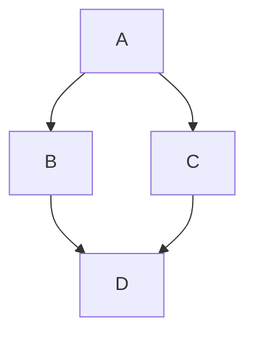
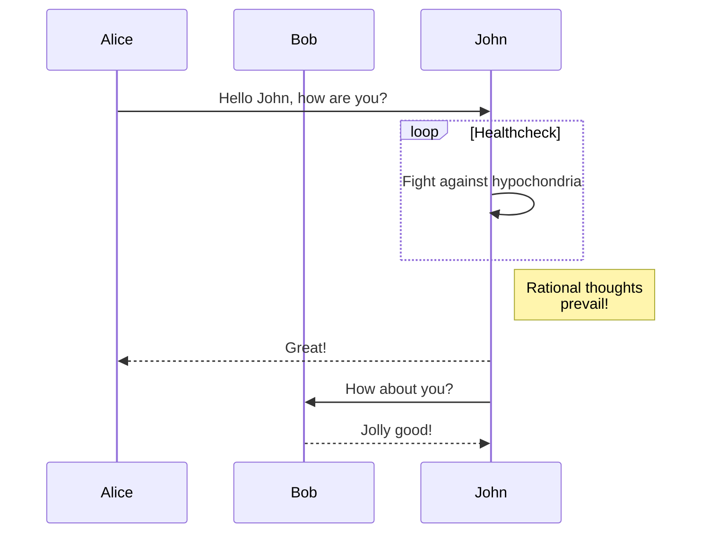
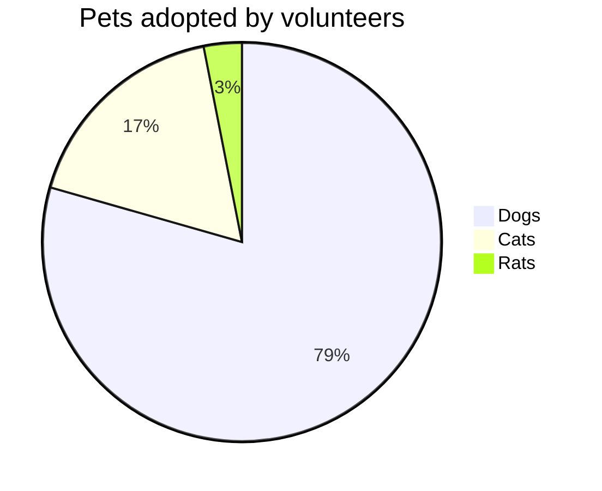

# GitHub Flavored Markdown — 兼容性验证清单

> **用途：** 在 VS Code 中打开此文件，使用 `vscode-github-markdown` 预览，与 [GitHub 上的渲染结果](https://github.com/lzm0x219/vscode-github-markdown/blob/main/test/fixtures/github-flavored-markdown-checklist.md) 逐项对比。
>
> **参考文档：**
>
> - [基本写作和格式语法](https://docs.github.com/zh/get-started/writing-on-github/getting-started-with-writing-and-formatting-on-github/basic-writing-and-formatting-syntax)
> - [使用高级格式](https://docs.github.com/zh/get-started/writing-on-github/working-with-advanced-formatting)

## 目录

- [一、基础排版](#一基础排版)
  - [1.1 标题](#11-标题)
  - [1.2 文本样式](#12-文本样式)
  - [1.3 段落与换行](#13-段落与换行)
  - [1.4 分割线](#14-分割线)
  - [1.5 转义与注释](#15-转义与注释)
  - [1.6 特殊字符](#16-特殊字符)
- [二、链接与引用](#二链接与引用)
  - [2.1 链接](#21-链接)
  - [2.2 章节链接与定位点](#22-章节链接与定位点)
  - [2.3 自动链接引用](#23-自动链接引用)
  - [2.4 提及与关键字](#24-提及与关键字)
- [三、代码与颜色](#三代码与颜色)
  - [3.1 行内代码与代码块](#31-行内代码与代码块)
  - [3.2 语法高亮](#32-语法高亮)
  - [3.3 颜色模型](#33-颜色模型)
- [四、列表](#四列表)
  - [4.1 无序与有序列表](#41-无序与有序列表)
  - [4.2 任务列表](#42-任务列表)
- [五、表格](#五表格)
- [六、引用与 Alerts](#六引用与-alerts)
  - [6.1 引用文本](#61-引用文本)
  - [6.2 Alerts](#62-alerts)
- [七、图片与媒体](#七图片与媒体)
- [八、折叠区块](#八折叠区块)
- [九、表情符号](#九表情符号)
- [十、脚注](#十脚注)
- [十一、GitHub 专属功能](#十一github-专属功能)
  - [11.1 Mermaid 图表](#111-mermaid-图表)
  - [11.2 GeoJSON / TopoJSON 地图](#112-geojson--topojson-地图)
  - [11.3 STL 3D 模型](#113-stl-3d-模型)
  - [11.4 数学表达式](#114-数学表达式)
- [十二、HTML 元素](#十二html-元素)
- [数据验证矩阵](#数据验证矩阵)

---

# 一、基础排版

## 1.1 标题

# Heading level 1

## Heading level 2

### Heading level 3

#### Heading level 4

##### Heading level 5

###### Heading level 6

## 1.2 文本样式

| 样式       | 语法                     | 输出                                  |
| ---------- | ------------------------ | ------------------------------------- |
| 粗体       | `**text**` 或 `__text__` | **This is bold text**                 |
| 斜体       | `*text*` 或 `_text_`     | _This text is italicized_             |
| 删除线     | `~~text~~`               | ~~This was mistaken text~~            |
| 粗斜体嵌套 | `**text _text_**`        | **This is _extremely_ important**     |
| 全部粗斜体 | `***text***`             | **_All this text is important_**      |
| 下标       | `<sub>text</sub>`        | This is a <sub>subscript</sub> text   |
| 上标       | `<sup>text</sup>`        | This is a <sup>superscript</sup> text |
| 下划线     | `<ins>text</ins>`        | This is an <ins>underlined</ins> text |

## 1.3 段落与换行

段落通过空行分隔。

这是第一段。这段包含多个句子用来测试段落间距和行高是否符合 GitHub 的渲染风格。段落之间的空白行应该产生明显的分隔效果。

这是第二段。在 GitHub 上，段落之间的间距比行间距更大，这让文档更易于阅读。

**换行符（`.md` 文件中需要特殊处理）：**

双空格换行：  
第二行（上一行末尾有两个空格）

反斜杠换行：\
第二行（上一行末尾有反斜杠）

`<br/>` 换行：<br/>第二行（上一行末尾有 `<br/>`）

## 1.4 分割线

三种写法效果相同：

---

---

---

## 1.5 转义与注释

**反斜杠转义：**

Let's rename \*our-new-project\* to \*our-old-project\*.

- \*这不是斜体\*
- \_这不是斜体\_
- \*\*这不是粗体\*\*
- \`这不是代码\`
- \# 这不是标题
- \- 这不是列表
- \> 这不是引用

**HTML 注释（隐藏内容）：**

<!-- This content will not appear in the rendered Markdown -->

<!--
多行注释
也不会显示
-->

## 1.6 特殊字符

- 版权符号：&copy; 2024
- 注册商标：&reg;
- 商标：&trade;
- 欧元符号：&euro;
- 破折号：&mdash; &ndash;
- 省略号：&hellip;
- 转义符：&amp; &lt; &gt; &quot; &apos;

---

# 二、链接与引用

## 2.1 链接

**内联链接：** [GitHub Pages](https://pages.github.com/)

**自动链接：** https://github.com

**带标题的链接：** [GitHub](https://github.com "Visit GitHub")

**相对链接：**

- [返回 README](../../README.md)
- [贡献指南](../../CONTRIBUTING.md)

## 2.2 章节链接与定位点

**章节链接：** 跳转到 [1.1 标题](#11-标题) | [五、表格](#五表格) | [十、脚注](#十脚注)

**自定义定位点：**

<a name="my-custom-anchor-point"></a>

这段文字没有自己的标题，但可以通过自定义定位点直接链接到它。

[跳转到自定义定位点](#my-custom-anchor-point)

## 2.3 自动链接引用

> **注意：** 以下功能仅在 GitHub Issues/PR/Discussions 中生效，`.md` 文件预览通常不生效。

**URL 自动链接：** Visit https://github.com

**Issue/PR 引用格式：**

| 引用类型            | 语法                                             |
| ------------------- | ------------------------------------------------ |
| Issue/PR URL        | `https://github.com/jlord/sheetsee.js/issues/26` |
| `#` + 编号          | `#26`                                            |
| `GH-` + 编号        | `GH-26`                                          |
| `User/Repo#` + 编号 | `jlord/sheetsee.js#26`                           |
| `Org/Repo#` + 编号  | `github-linguist/linguist#4039`                  |

**提交 SHA 引用：**

| 引用类型        | 语法                                                         |
| --------------- | ------------------------------------------------------------ |
| 提交 URL        | `https://github.com/jlord/sheetsee.js/commit/a5c3785`        |
| 完整 SHA        | `a5c3785ed8d6a35868bc169f07e40e889087fd2e`                   |
| `User@SHA`      | `jlord@a5c3785ed8d6a35868bc169f07e40e889087fd2e`             |
| `User/Repo@SHA` | `jlord/sheetsee.js@a5c3785ed8d6a35868bc169f07e40e889087fd2e` |

## 2.4 提及与关键字

> **注意：** 以下功能仅在 GitHub Issues/PR 中生效。

**@提及：** @github/support What do you think about these updates?

**Issue/PR 编号引用：** #1、#42

**关键字链接：**

| 关键字                        | 效果             |
| ----------------------------- | ---------------- |
| close / closes / closed       | 链接并关闭 Issue |
| fix / fixes / fixed           | 链接并关闭 Issue |
| resolve / resolves / resolved | 链接并关闭 Issue |
| Duplicate of #N               | 标记为重复       |

- `Closes #10` — 合并时自动关闭 Issue
- `Fixes octo-org/octo-repo#100`
- `Resolves #42`
- `Duplicate of #26` — 将当前 Issue/PR 标记为重复

---

# 三、代码与颜色

## 3.1 行内代码与代码块

**行内代码：** Use `git status` to list all new or modified files.

**无语言标识的代码块：**

```
git status
git add .
git commit -m "Initial commit"
```

**在代码块内显示反引号（四重反引号包裹）：**

````text
```
Look! You can see my backticks.
```
````

## 3.2 语法高亮

```typescript
function greet(name: string): string {
  return `Hello, ${name}!`;
}
```

```python
def fibonacci(n: int) -> int:
    if n <= 1:
        return n
    return fibonacci(n - 1) + fibonacci(n - 2)
```

```ruby
require 'redcarpet'
markdown = Redcarpet.new("Hello World!")
puts markdown.to_html
```

```css
.markdown-body {
  font-family: -apple-system, BlinkMacSystemFont, "Segoe UI", sans-serif;
  font-size: 16px;
}
```

```json
{ "name": "vscode-github-markdown", "version": "4.0.0" }
```

```yaml
on:
  push:
    branches: [main]
```

```diff
- const oldValue = "deprecated";
+ const newValue = "current";
```

```bash
#!/bin/bash
echo "Hello from bash"
```

## 3.3 颜色模型

> **注意：** 颜色可视化仅在 GitHub Issues/PR/Discussions 中受支持。

- 十六进制：`#0969DA` `#ffffff` `#000000`
- RGB：`rgb(9, 105, 218)` `rgb(255, 255, 255)`
- HSL：`hsl(212, 92%, 45%)` `hsl(0, 0%, 100%)`

---

# 四、列表

## 4.1 无序与有序列表

**无序列表（`-` `*` `+` 等效）：**

- George Washington

* John Adams

- Thomas Jefferson

**有序列表：**

1. James Madison
2. James Monroe
3. John Quincy Adams

**嵌套列表：**

1. First list item
   - First nested list item
     - Second nested list item
       - Third nested list item

2. First list item
   - First nested list item
     - Second nested list item

**混合嵌套：**

1. 第一步
   - 子任务 A
     1. 子子任务 1
     2. 子子任务 2
   - 子任务 B
2. 第二步
   > 列表中的引用
   >
   > 第二行引用

## 4.2 任务列表

- [x] #739
- [ ] https://github.com/octo-org/octo-repo/issues/740
- [ ] Add delight to the experience when all tasks are complete :tada:
- [x] 已完成的任务项
- [ ] 未完成的任务项
- [ ] \(Optional) Open a followup issue

> 任务列表项说明以括号开头时，需用 `\` 转义。

---

# 五、表格

**基本表格：**

| Left-aligned | Center-aligned |  Right-aligned |
| :----------- | :------------: | -------------: |
| `git status` |  _git status_  | **git status** |
| `git diff`   |   _git diff_   |   ~~git diff~~ |

**内联格式与样式：**

| 功能                       | 语法          | 状态 |
| -------------------------- | ------------- | ---- |
| **粗体**                   | `**text**`    | 支持 |
| _斜体_                     | `_text_`      | 支持 |
| `代码`                     | `` `code` ``  | 支持 |
| [链接](https://github.com) | `[text](url)` | 支持 |

**管道符 `|` 在单元格内需转义：**

| Name     | Character |
| -------- | --------- |
| Backtick | `         |
| Pipe     | \|        |

**表格前必须有空行才能正确渲染：**

| Command      | Description                                        |
| ------------ | -------------------------------------------------- |
| `git status` | List all _new or modified_ files                   |
| `git diff`   | Show file differences that **haven't been** staged |

---

# 六、引用与 Alerts

## 6.1 引用文本

单行引用：

> Text that is a quote

多行引用：

> This is a multi-line
> blockquote that spans
> several lines.

嵌套引用：

> Level one
>
> > Level two
> >
> > > Level three

## 6.2 Alerts

> [!NOTE]
> Useful information that users should know, even when skimming content.

> [!TIP]
> Helpful advice for doing things better or more easily.

> [!IMPORTANT]
> Key information users need to know to achieve their goal.

> [!WARNING]
> Urgent info that needs immediate user attention to avoid problems.

> [!CAUTION]
> Advises about risks or negative outcomes of certain actions.

**多行 Alerts：**

> [!NOTE]
> 这是第一行。
> 这是第二行。
>
> 这是新段落，中间有空行。

---

# 七、图片与媒体

**外部图片：**


**相对路径图片：**

| 上下文                  | 相对链接                                             |
| ----------------------- | ---------------------------------------------------- |
| 同一 `.md` 分支上的文件 | `/assets/images/electrocat.png`                      |
| 另一 `.md` 分支上的文件 | `/../main/assets/images/electrocat.png`              |
| Issues/PR/评论中        | `../blob/main/assets/images/electrocat.png?raw=true` |

**`<picture>` 元素：**

<picture>
  <source srcset="https://placehold.co/800x400/png?text=WebP" type="image/webp">
  
</picture>

---

# 八、折叠区块

**基本折叠：**

<details>
<summary>点击展开详情</summary>

可包含 **格式**、列表、代码块：

- item 1
- item 2

```javascript
console.log("Hello from inside details!");
```

</details>

**带标题和内容的折叠：**

<details>
<summary>Tips for collapsed sections</summary>

### You can add a header

You can add text within a collapsed section.

```ruby
puts "Hello World"
```

</details>

**默认展开（`open` 属性）：**

<details open>
<summary>This section is open by default</summary>

Here is some content that is visible without clicking.

- item 1
- item 2

</details>

---

# 九、表情符号

@octocat :+1: This PR looks great - it's ready to merge! :shipit:

| 表情       | 代码         |     | 表情    | 代码      |
| ---------- | ------------ | --- | ------- | --------- |
| :smile:    | `:smile:`    |     | :heart: | `:heart:` |
| :rocket:   | `:rocket:`   |     | :tada:  | `:tada:`  |
| :warning:  | `:warning:`  |     | :bulb:  | `:bulb:`  |
| :memo:     | `:memo:`     |     | :bug:   | `:bug:`   |
| :sparkles: | `:sparkles:` |     | :fire:  | `:fire:`  |

---

# 十、脚注

Here is a simple footnote[^1].

A footnote can also have multiple lines[^2].

脚注中可使用 Markdown 格式[^3]。

同一个脚注可以被多次引用[^1]。

[^1]: My reference.

[^2]:
    To add line breaks within a footnote, add 2 spaces to the end of a line.  
    This is a second line.

[^3]: 脚注中可以包含 **粗体**、_斜体_、`代码` 甚至 [链接](https://github.com)。

> **注意：** 脚注定义的位置不影响渲染位置——始终呈现在文档底部。Wiki 不支持脚注。

---

# 十一、GitHub 专属功能

> **注意：** 以下功能依赖 GitHub 平台特定实现，VS Code 本地预览中可能不会渲染。

## 11.1 Mermaid 图表

**流程图：**



**序列图：**



**饼图：**



## 11.2 GeoJSON / TopoJSON 地图

```geojson
{
  "type": "FeatureCollection",
  "features": [
    {
      "type": "Feature",
      "id": 1,
      "properties": {
        "ID": 0
      },
      "geometry": {
        "type": "Polygon",
        "coordinates": [
          [
            [
              -90,
              35
            ],
            [
              -90,
              30
            ],
            [
              -85,
              30
            ],
            [
              -85,
              35
            ],
            [
              -90,
              35
            ]
          ]
        ]
      }
    }
  ]
}
```

```topojson
{
  "type": "Topology",
  "transform": {
    "scale": [
      0.0005000500050005,
      0.00010001000100010001
    ],
    "translate": [
      100,
      0
    ]
  },
  "objects": {
    "example": {
      "type": "GeometryCollection",
      "geometries": [
        {
          "type": "Point",
          "properties": {
            "prop0": "value0"
          },
          "coordinates": [
            4000,
            5000
          ]
        },
        {
          "type": "LineString",
          "properties": {
            "prop0": "value0"
          },
          "arcs": [
            0
          ]
        },
        {
          "type": "Polygon",
          "properties": {
            "prop0": "value0"
          },
          "arcs": [
            [
              1
            ]
          ]
        }
      ]
    }
  },
  "arcs": [
    [
      [
        4000,
        0
      ],
      [
        1999,
        9999
      ],
      [
        2000,
        -9999
      ],
      [
        2000,
        9999
      ]
    ],
    [
      [
        0,
        0
      ],
      [
        0,
        9999
      ],
      [
        2000,
        0
      ],
      [
        0,
        -9999
      ],
      [
        -2000,
        0
      ]
    ]
  ]
}
```

## 11.3 STL 3D 模型

```stl
solid cube_corner
  facet normal 0.0 -1.0 0.0
    outer loop
      vertex 0.0 0.0 0.0
      vertex 1.0 0.0 0.0
      vertex 0.0 0.0 1.0
    endloop
  endfacet
  facet normal 0.0 0.0 -1.0
    outer loop
      vertex 0.0 0.0 0.0
      vertex 0.0 1.0 0.0
      vertex 1.0 0.0 0.0
    endloop
  endfacet
  facet normal -1.0 0.0 0.0
    outer loop
      vertex 0.0 0.0 0.0
      vertex 0.0 0.0 1.0
      vertex 0.0 1.0 0.0
    endloop
  endfacet
  facet normal 0.577 0.577 0.577
    outer loop
      vertex 1.0 0.0 0.0
      vertex 0.0 1.0 0.0
      vertex 0.0 0.0 1.0
    endloop
  endfacet
endsolid
```

## 11.4 数学表达式

> GitHub 使用 MathJax 渲染 LaTeX 数学表达式。

**内联（`$` 分隔符）：** $\sqrt{3x-1}+(1+x)^2$

**内联（反引号语法）：** $`\sqrt{3x-1}+(1+x)^2`$

**块级（`$$` 分隔符）：**

$$\left( \sum_{k=1}^n a_k b_k \right)^2 \leq \left( \sum_{k=1}^n a_k^2 \right) \left( \sum_{k=1}^n b_k^2 \right)$$

**块级（````math` 代码块）：**

```math
\left( \sum_{k=1}^n a_k b_k \right)^2 \leq \left( \sum_{k=1}^n a_k^2 \right) \left( \sum_{k=1}^n b_k^2 \right)
```

**更多示例：** $E = mc^2$ · $`\frac{a}{b}`$

```math
\begin{pmatrix}
a & b \\
c & d
\end{pmatrix}
```

---

# 十二、HTML 元素

**`<kbd>` 键盘按键：**

按 <kbd>Ctrl</kbd> + <kbd>C</kbd> 复制，按 <kbd>Command</kbd> + <kbd>V</kbd> 粘贴。

---

# 数据验证矩阵

> 以下注释用于自动化验证——每行对应一个需检测的渲染产物。

<!-- TASK_LIST: verify class="contains-task-list" and checkbox inputs -->
<!-- FOOTNOTES: verify class="footnote-ref", class="footnote-backref", section.footnotes -->
<!-- ALERTS: verify class="markdown-alert" and alert type classes -->
<!-- HEADINGS: verify h1-h6 rendering and heading anchors -->
<!-- CODE_BLOCKS: verify fenced code blocks with language identifiers -->
<!-- TABLES: verify table alignment classes -->
<!-- EMOJI: verify emoji shortcode rendering -->
<!-- STRIKETHROUGH: verify ~~ del tag rendering -->
<!-- ESCAPING: verify backslash escaping behavior -->
<!-- DETAILS: verify <details>/<summary> HTML rendering -->
<!-- MERMAID: verify mermaid diagram language support -->
<!-- MATH: verify LaTeX math expression rendering -->
<!-- AUTOLINK: verify URL auto-linking behavior -->
<!-- KEYWORDS: verify closes/fixes/resolves keyword behavior -->
