# 十一、GitHub 专属功能

> **用途：** 在 VS Code 中打开此文件，使用 `vscode-github-markdown` 预览，与 [GitHub 上的渲染结果](https://github.com/lzm0x219/vscode-github-markdown/blob/main/test/fixtures/github-flavored-markdown/11-github-platform-features.md) 逐项对比。
>
> **索引：** [返回总清单](../github-flavored-markdown-checklist.md)

> **注意：** 以下功能依赖 GitHub 平台特定实现，VS Code 本地预览中可能不会渲染。

## 11.1 Mermaid 图表

> Mermaid 支持的全部图表类型。

### 1. Flowchart（流程图）

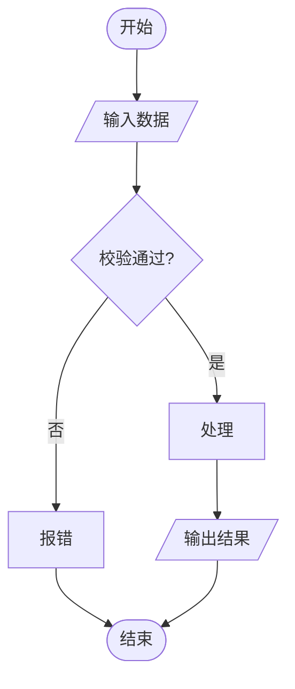

### 2. Sequence Diagram（序列图）

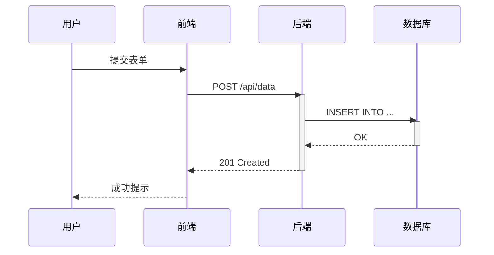

### 3. Class Diagram（类图）

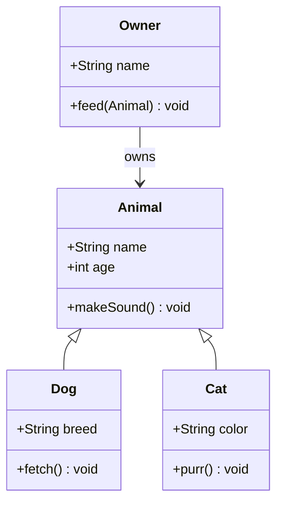

### 4. State Diagram（状态图）

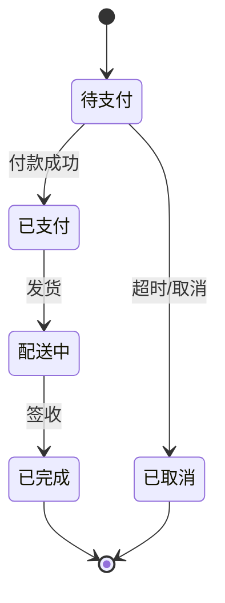

### 5. Entity Relationship Diagram（实体关系图）

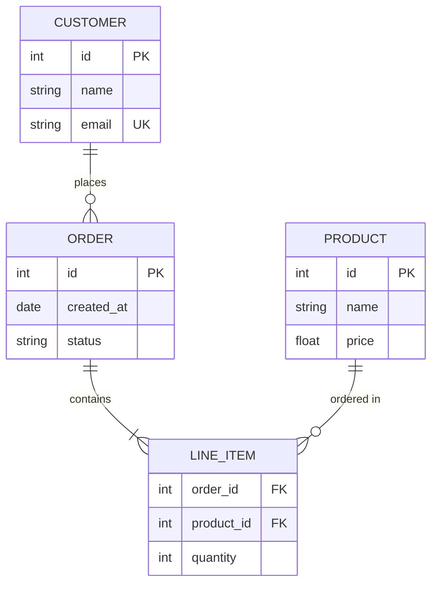

### 6. User Journey（用户旅程图）

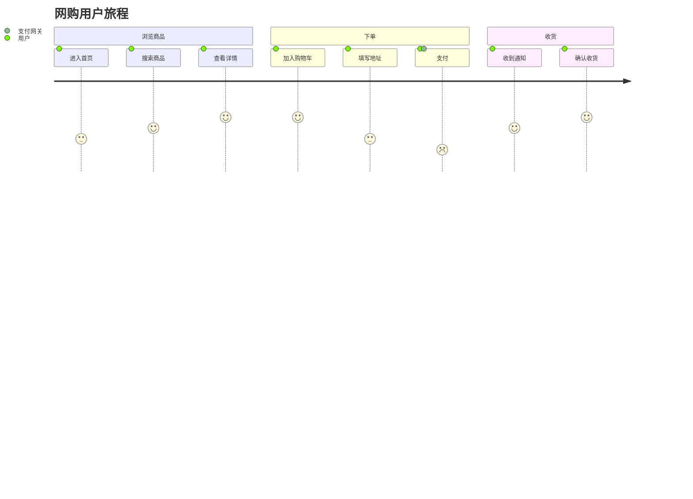

### 7. Gantt（甘特图）

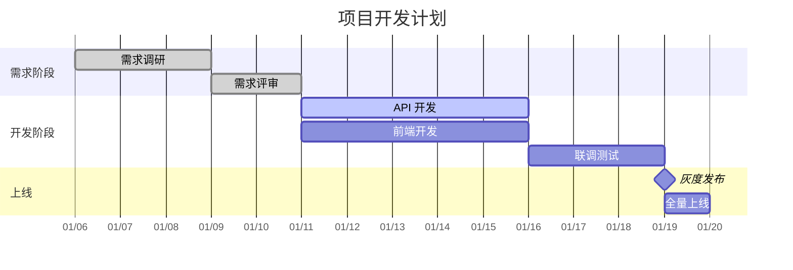

### 8. Pie Chart（饼图）

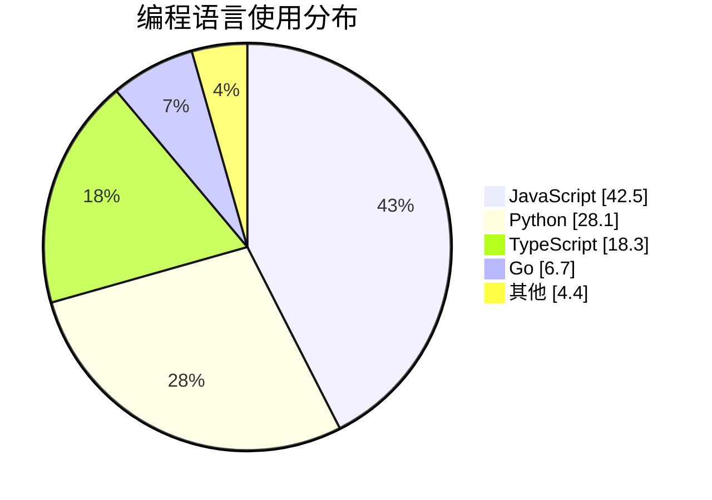

### 9. Quadrant Chart（象限图）

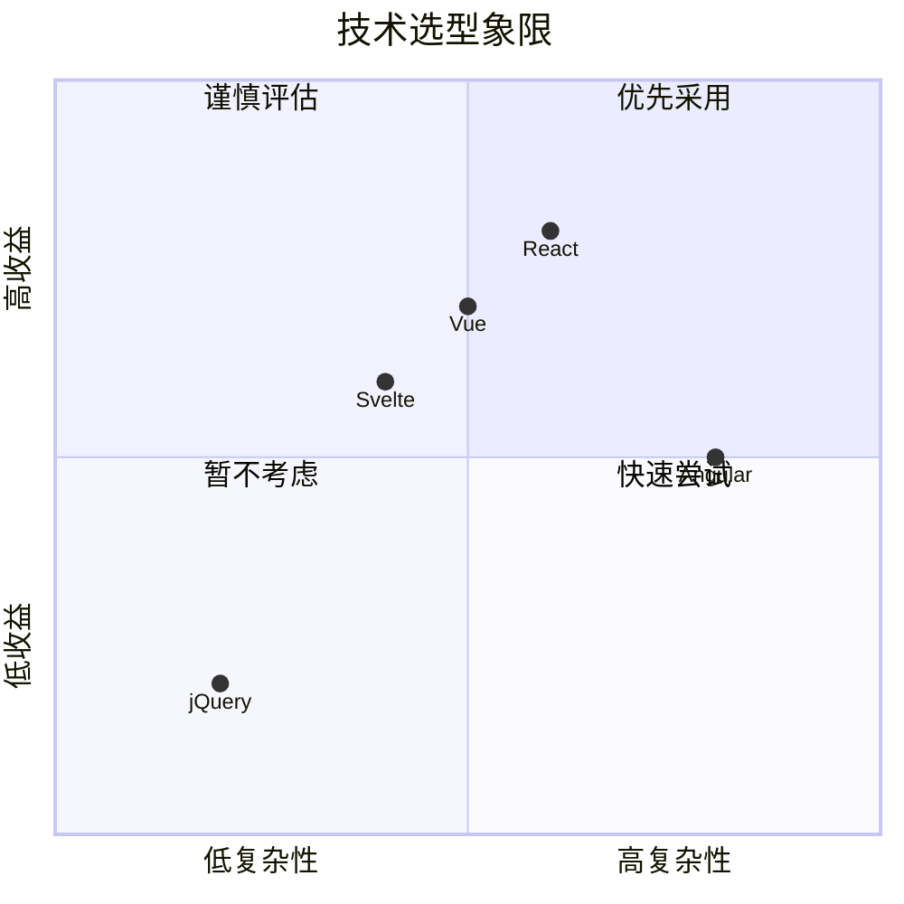

### 10. Requirement Diagram（需求图）

```mermaid
requirementDiagram
    requirement 用户登录 {
        id: REQ-001
        text: 用户可以使用邮箱和密码登录
        risk: low
        verifymethod: test
    }
    requirement 密码加密 {
        id: REQ-002
        text: 密码必须使用 bcrypt 加密存储
        risk: high
        verifymethod: inspection
    }
    requirement 会话管理 {
        id: REQ-003
        text: 登录后生成 JWT token
        risk: medium
        verifymethod: test
    }

    element 登录模块 {
        type: module
    }
    element 认证服务 {
        type: module
    }

    用户登录 - contains -> 密码加密
    用户登录 - contains -> 会话管理
    登录模块 - satisfies -> 用户登录
    认证服务 - satisfies -> 密码加密
    认证服务 - satisfies -> 会话管理
```

### 11. Git Graph（Git 图）

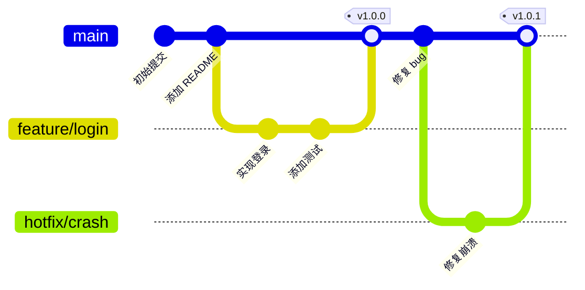

### 12. C4 Diagram（C4 图）

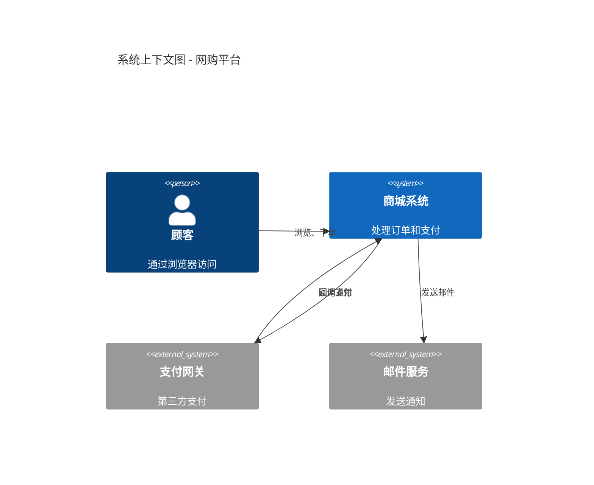

### 13. Mindmap（思维导图）

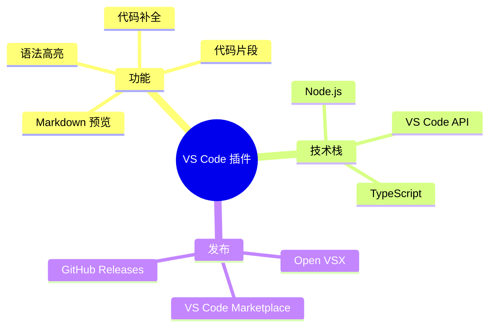

### 14. Timeline（时间线）

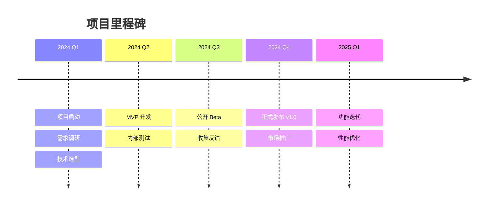

### 15. Sankey（桑基图）

```mermaid
sankey-beta

%% 用户流量分布
首页,商品列表 : 45.0
首页,搜索结果 : 30.0
首页,直接离开 : 25.0
商品列表,商品详情 : 35.0
商品列表,返回首页 : 10.0
搜索结果,商品详情 : 22.0
搜索结果,返回首页 : 8.0
商品详情,加入购物车 : 32.0
商品详情,离开 : 25.0
加入购物车,下单 : 20.0
加入购物车,离开 : 12.0
下单,支付成功 : 15.0
下单,支付失败 : 5.0
```

### 16. XY Chart（XY 图）

```mermaid
xychart-beta
    title "月度销售额（万元）"
    x-axis [一月, 二月, 三月, 四月, 五月, 六月]
    y-axis "销售额" 0 --> 100
    bar [45, 52, 38, 65, 72, 88]
    line [45, 52, 38, 65, 72, 88]
```

### 17. Block Diagram（框图）

```mermaid
block-beta
    columns 1
    block:App[应用层]
        columns 3
        Web["Web 前端"] API["API 网关"] Mobile["移动端"]
    end
    space
    block:Service[服务层]
        columns 2
        Auth["认证服务"] Biz["业务服务"]
    end
    space
    block:Data[数据层]
        columns 2
        DB[("主数据库")] Cache[("缓存")]
    end

    App --> Service
    Service --> Data
```

### 18. Packet（网络数据包图 — 仅限文字渲染）

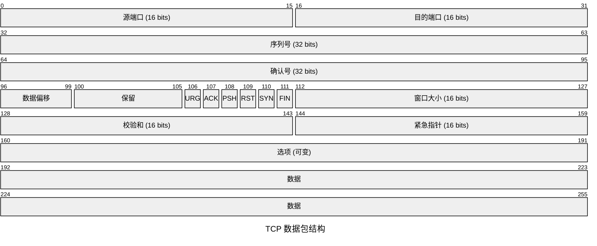

## 11.2 GeoJSON / TopoJSON 地图

```geojson
{
  "type": "FeatureCollection",
  "features": [
    {
      "type": "Feature",
      "id": 1,
      "properties": {
        "ID": 0
      },
      "geometry": {
        "type": "Polygon",
        "coordinates": [
          [
            [
              -90,
              35
            ],
            [
              -90,
              30
            ],
            [
              -85,
              30
            ],
            [
              -85,
              35
            ],
            [
              -90,
              35
            ]
          ]
        ]
      }
    }
  ]
}
```

```topojson
{
  "type": "Topology",
  "transform": {
    "scale": [
      0.0005000500050005,
      0.00010001000100010001
    ],
    "translate": [
      100,
      0
    ]
  },
  "objects": {
    "example": {
      "type": "GeometryCollection",
      "geometries": [
        {
          "type": "Point",
          "properties": {
            "prop0": "value0"
          },
          "coordinates": [
            4000,
            5000
          ]
        },
        {
          "type": "LineString",
          "properties": {
            "prop0": "value0"
          },
          "arcs": [
            0
          ]
        },
        {
          "type": "Polygon",
          "properties": {
            "prop0": "value0"
          },
          "arcs": [
            [
              1
            ]
          ]
        }
      ]
    }
  },
  "arcs": [
    [
      [
        4000,
        0
      ],
      [
        1999,
        9999
      ],
      [
        2000,
        -9999
      ],
      [
        2000,
        9999
      ]
    ],
    [
      [
        0,
        0
      ],
      [
        0,
        9999
      ],
      [
        2000,
        0
      ],
      [
        0,
        -9999
      ],
      [
        -2000,
        0
      ]
    ]
  ]
}
```

## 11.3 STL 3D 模型

```stl
solid cube_corner
  facet normal 0.0 -1.0 0.0
    outer loop
      vertex 0.0 0.0 0.0
      vertex 1.0 0.0 0.0
      vertex 0.0 0.0 1.0
    endloop
  endfacet
  facet normal 0.0 0.0 -1.0
    outer loop
      vertex 0.0 0.0 0.0
      vertex 0.0 1.0 0.0
      vertex 1.0 0.0 0.0
    endloop
  endfacet
  facet normal -1.0 0.0 0.0
    outer loop
      vertex 0.0 0.0 0.0
      vertex 0.0 0.0 1.0
      vertex 0.0 1.0 0.0
    endloop
  endfacet
  facet normal 0.577 0.577 0.577
    outer loop
      vertex 1.0 0.0 0.0
      vertex 0.0 1.0 0.0
      vertex 0.0 0.0 1.0
    endloop
  endfacet
endsolid
```

## 11.4 数学表达式

> GitHub 使用 MathJax 渲染 LaTeX 数学表达式。

**内联（`$` 分隔符）：** $\sqrt{3x-1}+(1+x)^2$

**内联（反引号语法）：** $`\sqrt{3x-1}+(1+x)^2`$

**块级（`$$` 分隔符）：**

$$\left( \sum_{k=1}^n a_k b_k \right)^2 \leq \left( \sum_{k=1}^n a_k^2 \right) \left( \sum_{k=1}^n b_k^2 \right)$$

**块级（````math` 代码块）：**

```math
\left( \sum_{k=1}^n a_k b_k \right)^2 \leq \left( \sum_{k=1}^n a_k^2 \right) \left( \sum_{k=1}^n b_k^2 \right)
```

**更多示例：** $E = mc^2$ · $`\frac{a}{b}`$

```math
\begin{pmatrix}
a & b \\
c & d
\end{pmatrix}
```

---
