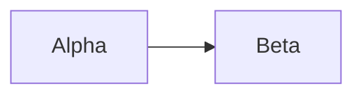

# Client rendering fixture

$$
\begin{aligned}
S_1 &= a_1 + a_2 + a_3 + a_4 + a_5 + a_6 + a_7 + a_8 + a_9 + a_{10} \\
S_2 &= b_1 + b_2 + b_3 + b_4 + b_5 + b_6 + b_7 + b_8 + b_9 + b_{10} \\
S_3 &= c_1 + c_2 + c_3 + c_4 + c_5 + c_6 + c_7 + c_8 + c_9 + c_{10} \\
S_4 &= d_1 + d_2 + d_3 + d_4 + d_5 + d_6 + d_7 + d_8 + d_9 + d_{10} \\
S_5 &= e_1 + e_2 + e_3 + e_4 + e_5 + e_6 + e_7 + e_8 + e_9 + e_{10} \\
S_6 &= f_1 + f_2 + f_3 + f_4 + f_5 + f_6 + f_7 + f_8 + f_9 + f_{10} \\
S_7 &= g_1 + g_2 + g_3 + g_4 + g_5 + g_6 + g_7 + g_8 + g_9 + g_{10} \\
S_8 &= h_1 + h_2 + h_3 + h_4 + h_5 + h_6 + h_7 + h_8 + h_9 + h_{10} \\
S_9 &= i_1 + i_2 + i_3 + i_4 + i_5 + i_6 + i_7 + i_8 + i_9 + i_{10} \\
S_{10} &= j_1 + j_2 + j_3 + j_4 + j_5 + j_6 + j_7 + j_8 + j_9 + j_{10} \\
S_{11} &= k_1 + k_2 + k_3 + k_4 + k_5 + k_6 + k_7 + k_8 + k_9 + k_{10} \\
S_{12} &= l_1 + l_2 + l_3 + l_4 + l_5 + l_6 + l_7 + l_8 + l_9 + l_{10}
\end{aligned}
$$
